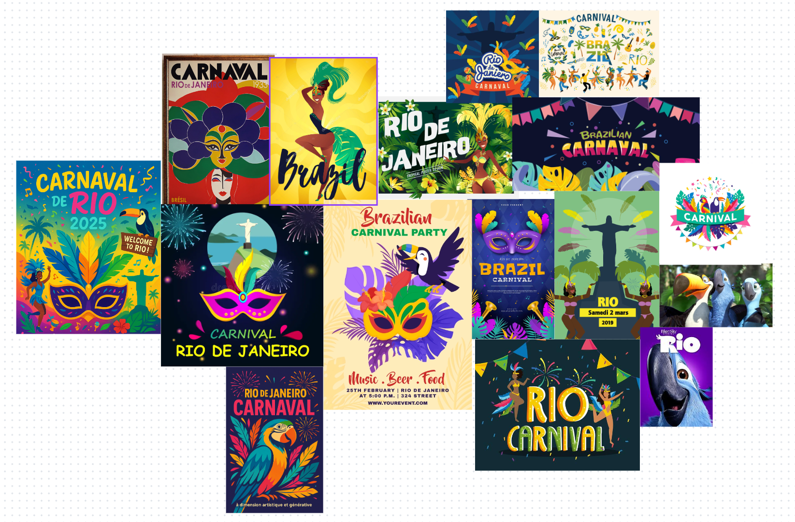

# 🎉 Carnaval de Rio Poster 🎭

---

## 🌈 Thème du Projet

Bienvenue dans notre projet **Carnaval de Rio Poster** !  
Ce projet célèbre la magie, la couleur et la joie du célèbre Carnaval de Rio de Janeiro.  
Plongez dans l’univers festif, rythmé par la samba, les costumes éclatants et l’esprit de fête brésilien ! 🇧🇷

---

## 👥 Collaborateurs

- **Noah Sfez**
- **Antoine Schmerber-Perraud**

---
## 🚀 Exécution du Projet

Pour visualiser le poster en local :

1. Ouvrez le dossier du projet dans **VS Code**.
2. Installez l’extension **Live Server** si ce n’est pas déjà fait.
3. Faites un clic droit sur `index.html` et sélectionnez **"Open with Live Server"**.
4. Le projet s’ouvrira automatiquement dans votre navigateur.

Vous pouvez également visualiser le projet en ligne ici :  
👉 [https://noah-sfez.github.io/RioPoster/](https://noah-sfez.github.io/RioPoster/)
## 🖼️ Moodboard

> _Image du moodboard_

---

## 🎨 Inspirations

- Costumes flamboyants
- Plumes et paillettes
- Parades spectaculaires
- Musique et danse

---

## 🥁 Viva o Carnaval! 🥁

> _“La vie est un carnaval, profitez de chaque instant !”_

---

    

